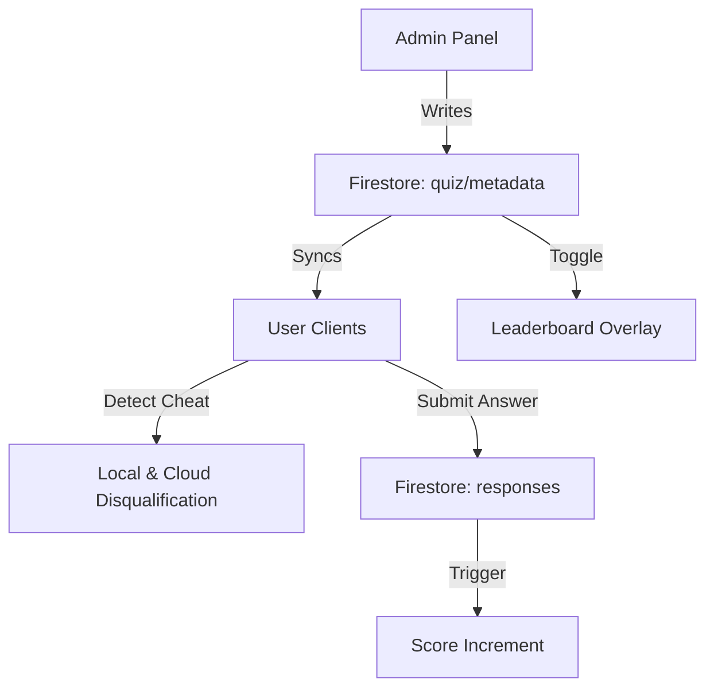

# 🎯 Heisenbyte Real-Time Technical Quiz System

> **Last Updated:** 12 March 2026

A real-time, admin-controlled technical quiz platform built for symposium and hackathon events.  
Teams compete simultaneously with time-based scoring, live leaderboard updates, and a proactive anti-cheat system.

---

## 📌 Project Overview

The Heisenbyte Quiz System is designed to conduct technical quiz events in a fully controlled and scalable manner.

The system allows:

- 👥 **Multiple teams** to register and participate simultaneously.
- 🎛️ **Admin Control**: Real-time management of the entire quiz flow.
- ⏱️ **Synced Timer**: 15–30 second countdown synchronized across all devices.
- 🏆 **Live Leaderboard**: Real-time ranking with optional admin-controlled visibility.
- 🚫 **Anti-Cheat Logic**: Automatic disqualification for tab switching or leaving the page.
- 🔄 **Session Sync**: Smooth quiz resets with `restartToken` allowing disqualified users to rejoin new sessions.
- 🔒 **Secure Backend**: Validation and scoring logic (extensible via Cloud Functions).

---

## 🚀 Key Features

### 👑 Admin Panel (`/admin`)
| Feature | Description |
|---|---|
| **Secure Login** | Firebase Email/Password Authentication |
| **Quiz Control** | Activate questions, reveal answers, and advance flow |
| **Leaderboard Toggle** | Show or hide the leaderboard on participant screens in real time |
| **Anti-Cheat Monitor** | Flag and track teams that attempt to switch tabs |
| **Full Reset** | Destructive reset of all teams, scores, and responses with session clearing |
| **Live Lobby** | Track connected teams and participant count (min 1 required for start) |
| **Theme** | Premium "Breaking Bad" aesthetics with neon toxic green highlights |

### 👥 User Panel (`/user`)
| Feature | Description |
|---|---|
| **Anonymous Access** | Quick join via anonymous authentication |
| **Team Registration** | Atomic name reservation (prevents duplicates) |
| **Live Question Feed** | Real-time question updates via Firestore listeners |
| **Session Persistence** | Survives refreshes and keeps user in the current question state |
| **Anti-Cheat Lock** | Detects tab visibility changes; disqualifies and bans device immediately |
| **Rejoin Support** | Smart detection of quiz restarts to lift bans for new sessions |
| **Score Popup** | Immediate visual feedback when the admin reveals the correct answer |

---

## 🏗️ System Architecture



---

## 🛠️ Tech Stack

| Component | Technology |
|---|---|
| **Frontend** | HTML5, CSS3 (Vanilla), JavaScript (ES6+) |
| **Cloud Provider** | Firebase (Project: `heisenbyte-quiz`) |
| **Database** | Cloud Firestore (`asia-south1`) |
| **Authentication** | Firebase Auth (Anonymous & Email/Password) |
| **Backend Logic** | Cloud Functions v2 (Node.js) |
| **Storage** | Browser `localStorage` & `sessionStorage` for session persistence |

---

## 📂 Project Structure

```
Quiz-project/
├── admin/                      # Admin panel (protected route)
│   ├── index.html              # Admin login page
│   ├── control.html            # Quiz control dashboard
│   ├── lobby.html              # Participant lobby view
│   ├── seed.html               # Question seeder UI
│   ├── js/
│   │   ├── auth.js             # Session-based login guard
│   │   ├── control.js          # Core engine for question flow & LB sync
│   │   └── firebase-config.js  # Global Firebase Initialization
│   └── css/                    # Breaking Bad theme styles
│
├── user/                       # Participant-facing app
│   ├── index.html              # Single-page quiz application
│   ├── app.js                  # User logic (Auth, Timer, Anti-cheat, Rejoin)
│   └── styles.css              # Dark-mode dashboard UI
│
├── functions/                  # Firebase Cloud Functions (v2)
│   ├── index.js                # Backend validation & scoring
│   └── package.json
│
├── firestore.rules             # Security rules (valid until 31 Mar 2026)
├── firebase.json               # Deployment & Emulator config
└── .firebaserc                 # Project alias mapping
```

---

## 🗄️ Firestore Data Model

### `quiz/metadata` — Global State
| Field | Description |
|---|---|
| `status` | `idle` · `active` · `ended` · `revealed` |
| `currentQuestion` | Index of the active question (0-based) |
| `restartToken` | Timestamp (ms) used to signal a new quiz session to all clients |
| `showLeaderboard` | Boolean toggle for user-side leaderboard visibility |
| `questionEndTime` | Server timestamp for hard deadline |

### `teams/{teamId}` — Participant Records
| Field | Description |
|---|---|
| `teamName` | Display name (also used as Document ID) |
| `score` | Cumulative points |
| `disqualified` | Boolean flag for anti-cheat triggers |
| `tabSwitched` | Specific flag for tab switching detection |

---

## 🔒 Security & Anti-Cheat

The system employs a multi-layered security approach:

1.  **Tab Switch Detection**: The `Page Visibility API` monitors if a user leaves the screen. If detected during an active question, the user is immediately disqualified and their device is permanently banned (`localStorage` flag).
2.  **Session Syncing**: The `restartToken` mechanism ensures that when an admin restarts the quiz, all clients (including banned ones) detect the new session and clear their local state to allow re-entry.
3.  **Atomic Name Reservation**: Team IDs are derived from normalized names, preventing multiple teams from using the same name.
4.  **Admin Auth**: Privilege actions require a session guard and are validated against the `ADMIN_EMAIL`.

---

## 🧮 Scoring Rules

| Category | Difficulty | Base Points |
|---|---|---|
| **Easy** | Python Basics / Trivia | 100 |
| **Medium** | ML / AI Concepts | 100* |
| **Hard** | Debugging / Fix-the-bug | 100* |

*\*Note: Implementation supports variable point values per question document.*

---

## ⚙️ Development & Deployment

### Local Development
1. `npm install -g firebase-tools`
2. `firebase login`
3. `firebase emulators:start`
4. Access App: `http://localhost:5000`
5. Access Admin: `http://localhost:5000/admin`

### Deployment
```bash
firebase deploy --only hosting,firestore:rules
firebase deploy --only functions
```

---

## 👥 Contributors

- **epradhiksha** — Project Lead & Full-Stack Developer

---

## 📄 License

ISC © 2026 Heisenbyte Quiz Team
